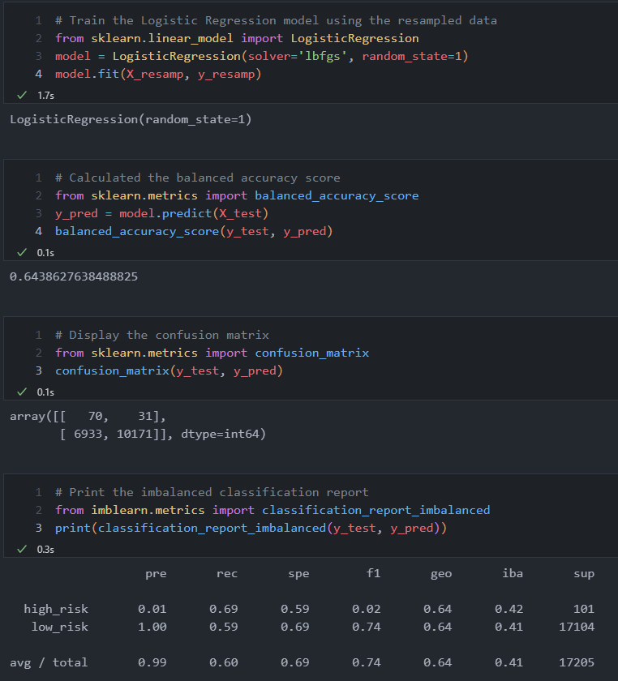

# <h1 style = "color: #29a200">Credit Risk Analysis :credit_card: :computer: :globe_with_meridians: </h1> 

## Overview of Project: 

In this project, we wanted to determine whether an individual was either a high or low risk to lend money to. This was achieved through supervised machine learning creating a model, evaluating the model, and then training the model using the "Loan_Stats.csv" file that was provided to us as our sample data. To build this model, we used Scikit-learn and imbalanced-learn Python Libraries to first build the model and then evaluate the model using the resampling method. The resampling consisted of oversampling using randomoversample and the smote algorithm. We also used undersampling the data and using the algorithm. To wrap things up, we compared the two machine learning models to cut down on bias using BalancedRandomForestClassifier and EasyEnsembleClassifier.

## The Results 

* Random oversampling says the balanced accuracy of the tests resulted in 64% but the precision for high risk is only 1% with a recall of 60%.

* SMOTE oversampling has an accuracy of 66% with the precision of high risk once again being at 1%. This time though, the recall is at 69%.

* Undersampling results have an accuracy of 52% with the precision of high risk at 1% and a recall rate of 40%. 

* The combination of over and undersampling have an accuracy of 64% with the precision of high risk at 1% and a recall rate of 57%.

* The BalancedRandomForestClassifier has an accuracy of 78% with the precision of high risk at 30% and a recall rate of 87%.

* The Easy Ensemble AdaBoost Classifier has an accuracy of 93% with the precision of high risk at 90% and a recall rate of 94%.

